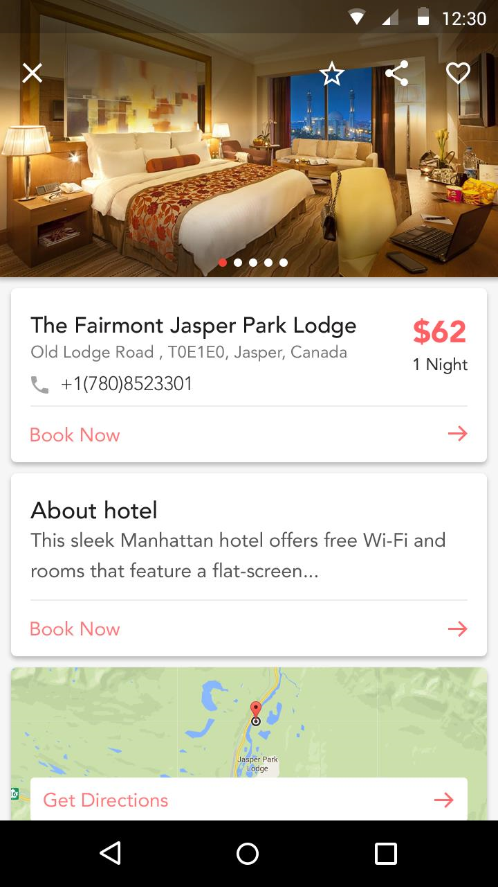

# HotelPardis - Database Course Project

HotelPardis Android App was developed in 2015 as part of the Database Course in University of Tehran.

This project aimed at implementing a simple hotel management application with SQL database.

## Features
**User Authentication**: login and registration system for customer and administrators.\
**Room Management**: View, add, edit, and delete rooms with various details like room type, capacity, and availability.\
**Guest Management**: Manage guest information, bookings.\
**Database Integration**: Utilize a well-structured database to store and retrieve hotel-related data.

## Installation
1. Clone the repository to your local machine using the following command:
```bash
git clone https://github.com/ali-mohammadi/HotelPardis.git
```
2. Open the project in Android Studio.
3. Build the project.
3. Connect your Android device or use an emulator to run the app.

## Screenshot


## Technologies Used
- **Java**: The core programming language used for Android app development.
- **Android Studio**: The integrated development environment for building Android apps.
- **SQLite**: The local database used to store hotel information.


## Contributors
Ali Mohammadi\
Parsa Vafaie

## License
This project is licensed under the MIT License.